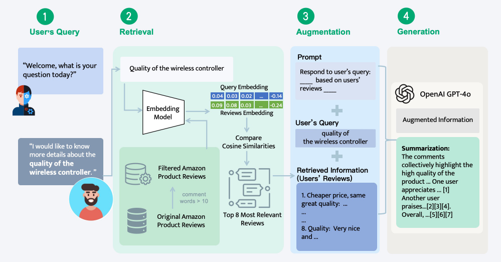

You can find my CV here: [Lei's Curriculum Vitae](../Lei_CV.pdf).

I am a fourth-year undergraduate student in the Department of Industrial Engineering & Management at [Shanghai Jiao Tong University](https://en.sjtu.edu.cn/). I am majoring in Industrial Engineering and minoring in Finance.

Currently, I am extremely fortunate to be advised by [Prof. Zikun Ye](https://zikunye.com/) on Source Attribution in Generative LLMs. Simultaneously, I also have the greatest honor to be supervised by [Prof. Natalie Mizik](https://foster.uw.edu/faculty-research/directory/natalie-mizik/) on Gaining Hydrogen Perceptions based on social media analysis. 

My research interests mainly focus on quantitative marketing, especially the application of Large Language Models.

Academic Achievements
------
* Major GPA: 91.64/100
* Ranking: 1/55
* Core Coursework: Stochastic Models(100), Machine Learning(99), Linear Algebra(98), Engineering Statistics(95), Data Structure(95), Operations Research(92), Econometrics(90)
* You can find my transcript here: [Lei's Transcript](../files/Transcript.pdf).

Research Experience
------
### Value Attribution for LLM Summaries: Data Shapley Approach                   

* Proposed a systematic framework using Shapley values to transparently quantify the contribution of each
information source in LLM-generated summaries, in the context of SearchGPT.
* Developed a novel Thematic Embedding Clustering algorithm leveraging theme-driven information extraction and
embedding similarity, aimed at reducing computational costs in Shapley value calculations.
* Tested the efficiency of our algorithm on a large-scale Amazon review dataset, achieving approximately 50%
computational savings at an MAE of 0.15 compared to baseline methods.

### Equitable Hydrogen Technology Community Engagement                

* Collected and analyzed one million posts on hydrogen energy from Reddit and Twitter, conducted sentiment
classification using LLMs, and applied theme-driven topic modeling with BERTopic.
* Developed a preliminary pipeline using machine learning methods to identify disadvantaged groups, promoting
equity within social media communities.

Project Experience
------

### Sentiment Explorational Analysis Based on Movie Reviews            

* Compared sentiment analysis models using both dictionary-based methods and word embedding techniques.
* Identified potential manipulation in movie ratings through statistical tests (t-tests) and clustering (K-means),
providing insights into self-boosting behaviors.
* Developed and implemented a user-friendly movie search engine utilizing Douban movie review datasets, enabling users to conduct open-ended, sentiment-based searches to enhance user experience and engagement.

### Autonomous Vehicle Navigation and Obstacle Avoidance Project                   

* Developed and trained a CNN model using ResNet18 on a custom-labeled image dataset to enable key functions for autonomous navigation, including route recognition and traffic light detection.
* Integrated radar-based sensing to enhance obstacle detection, enabling the vehicle to autonomously avoid obstacles after object identification along its path.

<video width="400" height="480" controls>
  <source src="../files/self_driving_video.mp4" type="video/mp4">
  Your browser does not support the video tag.
</video>

### Simulation Evaluation and Optimization of Operational Status at N Bank

* Conducted on-site research and used the collected data to build a simulation model of the bank's operational processes in Arena, identifying existing inefficiencies and bottlenecks.
* Formulated objective functions to minimize service time and maximize operational efficiency. Applied combinatorial optimization under real-world constraints, including capacity and budget limitations, and used OptQuest software to solve the optimization problem. Integrated a social force model to enhance the simulation's accuracy and realism.

Selected Awards
------
* 2023 National Scholarship for Undergraduate Students (Top 0.2% among Chinese students)
* 2023 Finalist Award for the U.S. College Mathematical Contest in Modeling (Top 1% worldwide)
* 2022 Toyota Boshoku Scholarship of Shanghai Jiao Tong University (Top 2% of SJTU)
* 2022, 2023 Merit Student of Shanghai Jiao Tong University (Top 5% of SJTU)

Extracurricular Activities
------
* Scholars and Achievers Club of SJTU, Core Member                                                 (_Jun. 2023 - Present_)
* Ernst & Young Advisory, Corporate Tax Intern                                 (_Aug. 2023 - Sept. 2023_)
* GF Securities, Research Intern                                                  (_Sep. 2023 - Dec. 2023_)
* Sealand Securities, Research Intern                                           (_Jun. 2023 - Sept. 2023_)

Contact
------
* Email: wanglei123sjtu@gmail.com
* Wechat: Triplestone0603
